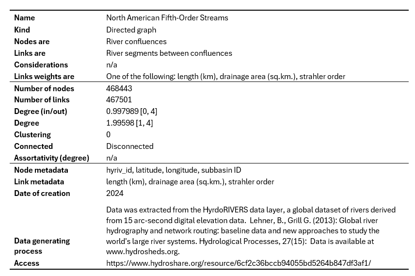

# Binary Rivers

  

## Overview

Graphs are an efficient data structure for representing and analyzing river network network topology. Such topology, and its associated feature-space, can provide insight into the diversity of hydrologic responses seen across catchments. This library provides several tools for extracting such features of binary tree graphs.

<b>Current functionality includes:</b>

 - Efficient extaction of Edge and Node tables from HydroRIVERS (Lehner, 2013) database
  - Measurement of edge and network features described in Ichoku & Chorowicz 1993
  - Miscellaneous network metrics (leaf count, average depth, height, and compactness)

<b>Planned functionality includes:</b>

 - Markov chain Monte Carlo sampling of topologically distinct channel networks (TDCNs)
 - Something to do with the Critical Tokunaga Model of Kovchegov et. al., 2022

  

References:

<i>Lehner, B., Grill G. (2013): Global river hydrography and network routing: baseline data and
new approaches to study the world’s large river systems. Hydrological Processes, 27(15):
2171–2186. Data is available at www.hydrosheds.org.</i>

<i>Ichoku, C., and J. Chorowicz (1994), A numerical approach to the analysis and classification of channel network patterns, Water Resour. Res., 30(2), 161–174, doi:10.1029/93WR02279.</i>

<i>Kovchegov, Y., Zaliapin, I., & Foufoula-Georgiou, E. (2022). Critical Tokunaga model for river networks. Physical Review E, 105(1), 014301. https://doi.org/10.1103/PhysRevE.105.014301 </i>

## North American Fifth Order Streams Dataset

A pre-processed node and edge dataset of all fifth-order North American streams is available for download at https://www.hydroshare.org/resource/6cf2c36bccb94055bd5264b847df3af1/

  

## Questions and Suggestions

Please reach out to scott.lawson@uvm.edu with any questions.