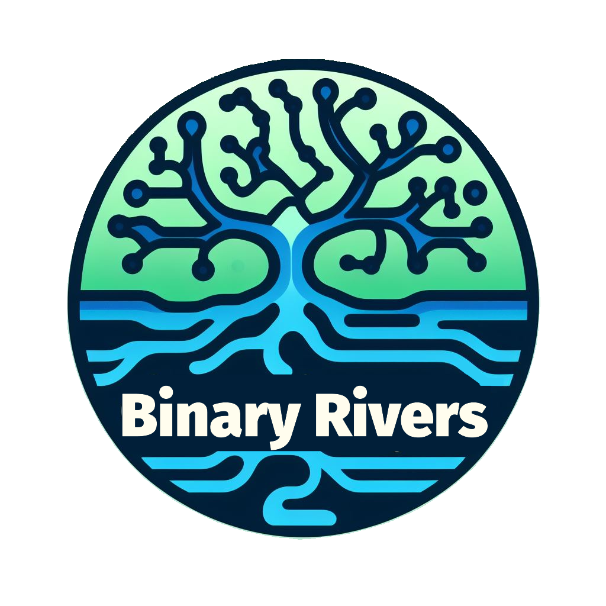

# North American Fifth-Order Streams Dataset

  

## Overview

Graphs are an efficient data structure for representing and analyzing river network network topology. Such topology, and its associated feature-space, can provide insight into the diversity of hydrologic responses seen across catchments. This dataset contains binary tree representations of fifth-order North American rivers. The network data was extracted from the HydroRIVERS dataset of Lehner & Grill, 2013. Node metadata includes hyriv_id, latitude, longitude, and subbasin ID. Edge metadata includes length (km), drainage area (sq.km.), strahler order.  
  

Reference:
<i>Lehner, B., Grill G. (2013): Global river hydrography and network routing: baseline data and
new approaches to study the world’s large river systems. Hydrological Processes, 27(15):
2171–2186. Data is available at www.hydrosheds.org.</i>

## Network Card
  

## Download the Dataset!

You can download the dataset at: https://www.hydroshare.org/resource/6cf2c36bccb94055bd5264b847df3af1/

## Issues and Questions

Please reach out to scott.lawson@uvm.edu with any questions.